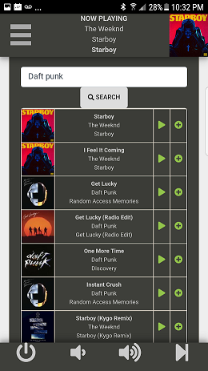
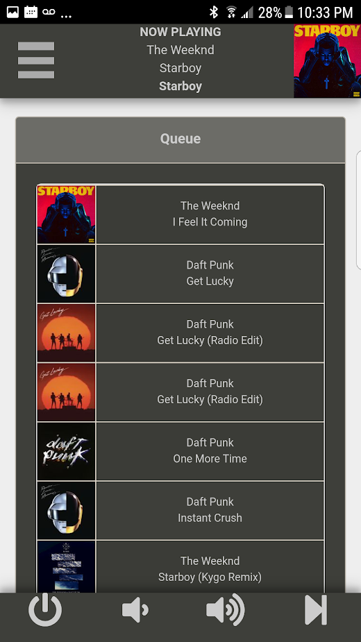
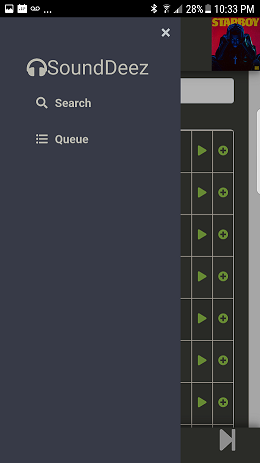

Introduction
=====
This project provides a different front-end to WiFi connected Bose Soundtouch sound systems. This came about by a few problems I had with the official Bose app:

a) anyone who visited your house and wanted to play music had to download the app.

b) There was no way to "queue up" a song so that it played after other songs were played.

This project basically turns your device into a virtual jukebox. Anyone on your WiFi can queue up or play any song available on Deezer.

Screenshots
=====




About
=====
The project consists of two different servers. A back-end server written in Go and a front end server written in node/React. The backend server handles all communication to the sound system and serves JSON to the front end server. The front end server pulls the JSON data from the backend server and displays it in a GUI using a React framework.

Instructions
=====
I plan to make more changes to the setup to make it a little more user friendly, but right now you'll need to do a bit of work.

Open /sounddeez/goBose/bose.go and change this variable to the IP of your sound system:

```go
const SPEAKER_IP = "http://192.168.0.14:8090/"
```

Start the backend Go server:

```go
go run bose.go
```

Go to /sounddeez/src/pages/bosemain.js and change this line to the IP of your backend go server. Note: you can run the backand and frontend on the same server, but don't use localhost. Using localhost will cause the end-user's client to look for the server on its localhost.

```javascript
this.state.controllerIP = "http://192.168.0.16:9000"
```
The following is a bit of a hack that I'll be changing soon, but you'll need to open /sounddeez/src/components/Queue.js and set you backend IP here:

```javascript
fetch('http://192.168.0.16:9000/queue')
```
go to /sounddeez/ and start the frontend server:

```bash
npm install
npm start
```

To see if it's working, go to http://<frontend_ip>:3000/#/bosemain/search


Issues
=====
This is formatted to run on mobile right now. You can use the front end on PC, but it looks wonky.


